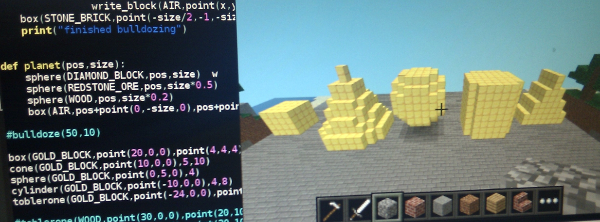

# Minecraft Programming with Python

Learning programming via procedural architecture in Minecraft using the
Raspberry Pi. Various projects and lesson plans tested on teenagers in
Cornwall. Developed with the support of [dBsCode](http://dbscode.co.uk/)

# Example projects

* [01 Infinite house generator](doc/projects/01-house.md)
* [02 Auto castle](doc/projects/02-auto-castle.md)
* [03 Random skyscrapers](doc/projects/03-skyscraper-tunnels.md)
* [04 Giant spider](doc/projects/04-spider.md)

[Cheat sheet](doc/docs.md)
