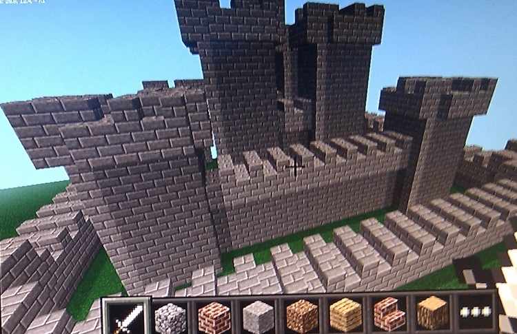

# Auto-Minecraft-Castle

Before you start:

* Launch Minecraft and create a new world.
* Launch Geany

## Step 1 Make a battlement function

* In Geany, from the file menu select "new", and then save as `castle.py` in the "pi"
  directory.

* We need to import the dBsCode commands we'll be using and clear an
area in the Minecraft world for working in. Create this program:

        from dbscode_minecraft import *
        bulldoze()

* **Test** Press F5 to run the program (this will also save your
program for you). After a few seconds you should see a "flatworld" type
of environment.

* Lets make a function to create a battlement. We'll reuse this to
create the bits of our castle we need. It'll use parameters so we can
specify the position, length and height of a section.

        def battlement_x(pos, length, height):
            box(STONE_BRICK,pos,point(length,height,1))
            box(STONE_BRICK,pos+point(0,height,-1),point(length,2,3))
            for i in range(0,length/2):
                box(STONE_BRICK,pos+point(i*2,height+2,-1),point(1,1,3))

We create two boxes, one for the wall itself, the other for a thicker
top section. Then we use a for loop to create all the knobbly bits at
the top (called crenels according to wikipedia). The loop automatically
creates enough to fill the battlement whatever length it is.

Test it with something like:

         battlement_x(point(0,0,0),10,5)

Press F5 to check your battlement!

## Step 2 Make a battlement in the other direction

We also need a battlement in the Z direction. Don't type this out,
copy/paste `battlement_x` and change it. Hint - you mainly need to swap
the first and last parameters of the point functions.

        def battlement_z(pos, length, height):
            box(STONE_BRICK,pos,point(1,height,length))
            box(STONE_BRICK,pos+point(-1,height,0),point(2,2,length))
            for i in range(0,length/2):
                box(STONE_BRICK,pos+point(-1,height+2,i*2),point(3,1,1))

Let's test that both of these work:

         battlement_x(point(0,0,0),10,5)
         battlement_z(point(0,0,0),10,5)

Press F5. You should see two battlements going at 90 degrees to each
other from the centre of the world.

## Step 3 Make a castle_walls function

We can now use these two functions to create one that draws a complete
set of walls of any size and position that you pass in.

        def walls(pos,size):
            battlement_x(pos,size.x, size.y)
            battlement_z(pos,size.z, size.y)
            battlement_x(pos+point(0,0,size.z),size.x, size.y)
            battlement_z(pos+point(size.x,0,0),size.z, size.y)

Test this with something like:

        walls(point(0,0,0),point(10,5,10))

The first and last (X and Z) numbers of the size control the wall
rectangle while the middle (Y) number controls the height.

## Step 4 Make a tower function

This one is very simple - we can use the walls command with a tall
height as a tower:

        def tower(pos,height):
            walls(pos,point(5,height,5)

Try making lots of towers to test this.

## Step 5 Build a castle function

If we position towers at the corner of a set of walls, we start to get
something more castle like. We need to shift the towers slightly so they
are centred correctly:

    def castle(pos,size):
        walls(pos,size)
        tower(pos+point(-2,0,-2),size.y*2)
        tower(pos+point(size.x-2,0,size.z-2),size.y*2)
        tower(pos+point(-2,0,size.z-2),size.y*2)
        tower(pos+point(size.x-2,0,-2),size.y*2)

## Challenges

* Can you make a super-castle function by nesting multiple castles
  inside each other (like in the screen shot above)?
* We haven't tried changing the block material. Can you find a way of
  doing this so castles can be built from different block types you
  control?
* Is there a way of using randomness to make your castles more
  interesting?
